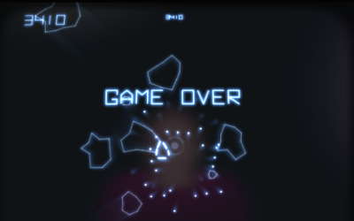

# Behind Asteroids, The Dark Side [](http://js13kgames.com/)

## Synopsis

Ever wondered what is happening under the hood of an Asteroids Arcade machine?
I can tell you: A greedy evil 25¢ money maker engine.



## Context

This is an entry for [js13kGames](http://js13kgames.com/entries/2015). Theme was **"Reversed"**.

## Game versions

The game both works for mobile and desktop but the gameplay varies.
The desktop version is a [touch typing](https://en.wikipedia.org/wiki/Touch_typing) game
where the mobile version is a simple touch game. If you are not good at typing on keyboards,
just prefer the mobile version.

On mobile (especially for iOS Safari), please use **Add to Home screen** for better experience.

## The game

Behind Asteroids is a game about throwing asteroids to people playing "Asteroids"
on an arcade machine. Like in Asteroids game, player have 3 extra lifes.
The goal is to make the player lose and try to earn as much coins as possible.
When a player lose, another come and put a new coin in the arcade.


There are different game mechanism involved, they get introduced in first levels
and get harder and harder to use:

- The Asteroids have an aiming centered in the spaceship that varies the throw velocity
- The Asteroids aiming rotates (Player >2)
- The "RED" area in the aiming that make you fail the throw (Player >3)
- The UFO bonus that you get after sending asteroids without failing to throw an asteroid (Player >4)


### Game Over

Everytime the player is reaching 10'000 points, he wins a new extra life,
You lose if player reaches 5 lifes.


## Tech overview

- Canvas2D for the game primitives drawing
- [WebGL](src/lib/webgl.js) for post processing effects (7 fragment shaders)
- [Web Audio API](src/lib/audio.js) + [jsfxr](src/lib/jsfxr.js) ([14 sounds](src/sounds.js))
- [Asteroid fonts implemented "by hand"](src/lib/asteroids.font.js)
- *... (more to describe later)*

## Build system

The build system is dedicated to JS13K and made with a few simple [scripts](package.json).
It is able to copy assets, [concat all files](scripts/concat.sh), [minify the GLSL code](scripts/compileglslfiles.sh), minify the JavaScript, zip the result and give size information.

Things are a bit specific to my need but remain very simple, modular and powerful, you could easily fork it.

### dev

```
npm run liveserver
```

```
npm run watch
```

### prod

```
npm run build
```
